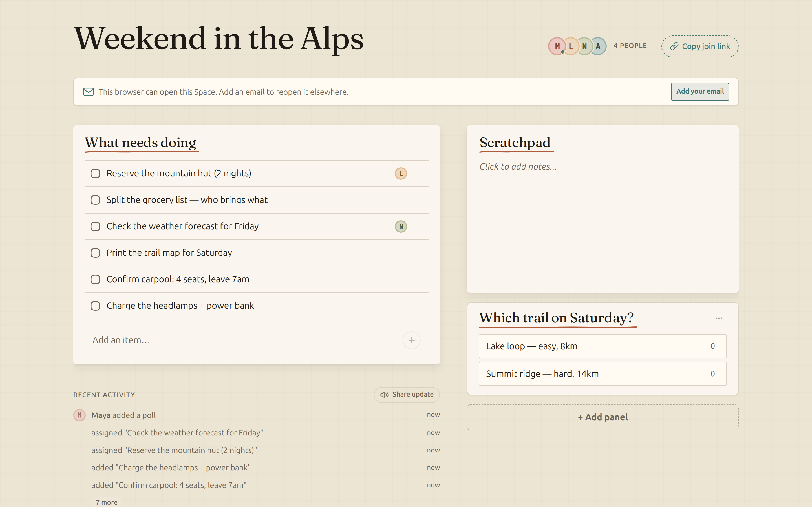

<p align="center">
  
</p>

<h1 align="center">Plainspace</h1>

<p align="center">
  <strong>Shared plans without the project-management overhead.</strong><br>
  Tasks, notes, polls, and reminders in one simple Space.
</p>

<p align="center">
  <a href="https://plainspace.org"><strong>Try Plainspace →</strong></a>
  &nbsp;·&nbsp;
  <a href="docs/self-hosting.md">Self-host</a>
  &nbsp;·&nbsp;
  <a href="CONTRIBUTING.md">Contribute</a>
</p>

<p align="center">
  <a href="https://github.com/super-productivity/plainspace/actions/workflows/ci.yml"></a>
  <a href="LICENSE"></a>
</p>



<p align="center"><em>One shared page for a weekend trip, household, club, or small team.</em></p>

## Lightweight coordination for real life

- **Share one link** — people can participate in any browser, without an app or account.
- **Keep everything together** — tasks, notes, checklists, polls, and availability.
- **Stay in sync** — live updates and optional push reminders keep the plan moving.
- **Choose how to run it** — use the hosted version or self-host with Docker.

## Choose your path

- **Use the hosted app:** [create a Space on plainspace.org →](https://plainspace.org)
- **Run it yourself:** [read the complete self-hosting guide →](docs/self-hosting.md)

## Self-host quick start

```sh
git clone https://github.com/super-productivity/plainspace.git
cd plainspace
cp .env.production.example .env   # fill in the required values
docker compose pull && docker compose up -d --no-build
```

Then put a reverse proxy in front for TLS. The full guide — env values,
nginx/Caddy configs, email, backups, upgrades — is in
[docs/self-hosting.md](docs/self-hosting.md). If you host for anyone beyond
yourself, replace the legal pages with your own (see the guide's §9).

## Development

Plainspace is an npm-workspaces TypeScript application with a SolidJS PWA,
a Hono API, and PostgreSQL via Drizzle ORM.

1. Install Node.js 22 and Docker.
2. Install dependencies with `npm ci`.
3. Copy `.env.example` to `.env` and adjust the local database settings.
4. Start PostgreSQL and apply migrations with `npm run db:up`.
5. Start the API and web app with `npm run dev`.

### Commands

| Command               | Purpose                                          |
| --------------------- | ------------------------------------------------ |
| `npm run dev`         | Start the Hono API and Vite development server   |
| `npm run check`       | Run type checking, ESLint, and formatting checks |
| `npm test`            | Run web and server tests                         |
| `npm run test:e2e`    | Run the Playwright browser suite                 |
| `npm run build`       | Build the production PWA                         |
| `npm run db:generate` | Generate migration metadata (see warning below)  |
| `npm run db:migrate`  | Apply pending database migrations                |

> **Migration warning:** do not run `db:generate` for a new schema change
> yet. Drizzle snapshots stop at migration 0012, so post-0012 migrations
> are hand-reviewed SQL plus `_journal.json`. Reconcile the snapshot chain
> before generating new migrations from the schema.

### Structure

- `packages/shared` — shared schemas, types, and constants
- `packages/server` — Hono routes, Postgres schema, migrations, and services
- `packages/web` — SolidJS application and service worker
- `packages/e2e` — Playwright browser tests
- `docs` — self-hosting guide, architecture decisions, and design plans

Production intentionally runs one API process because SSE presence, rate
limiting, and reminder recovery are in memory. See
[Self-hosting](docs/self-hosting.md) and
[Scaling decision](docs/scaling-decision.md) before changing that topology.

## Contributing

See [CONTRIBUTING.md](CONTRIBUTING.md). Security reports:
[SECURITY.md](SECURITY.md).
